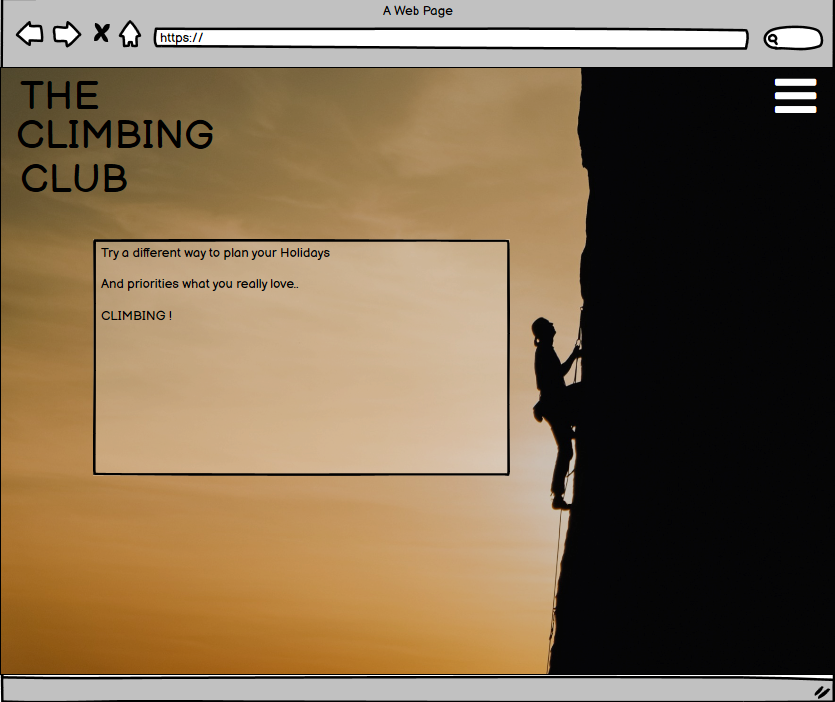
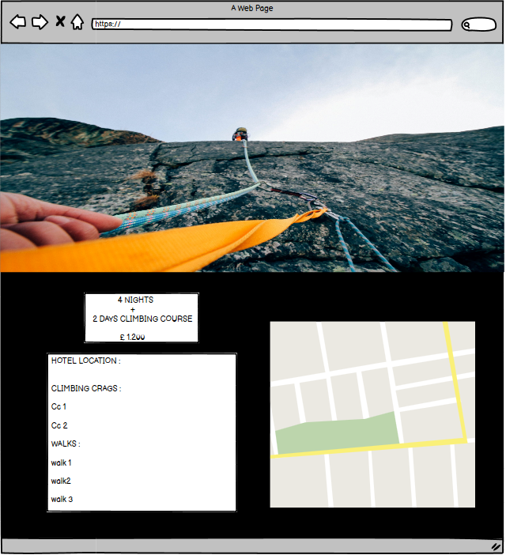
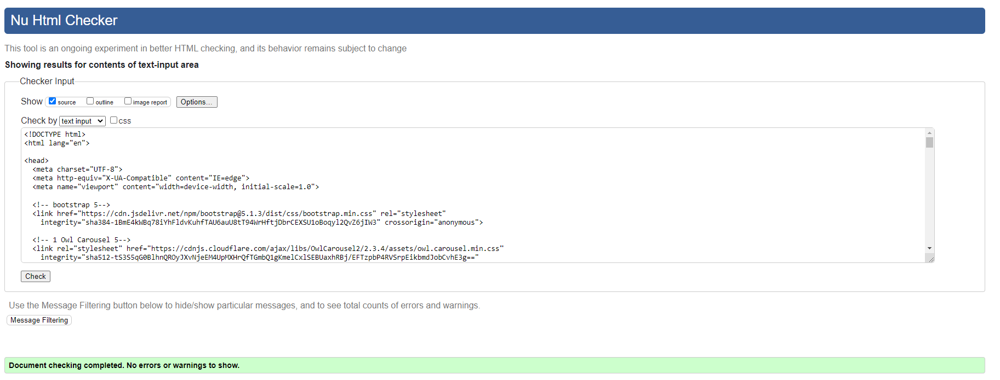
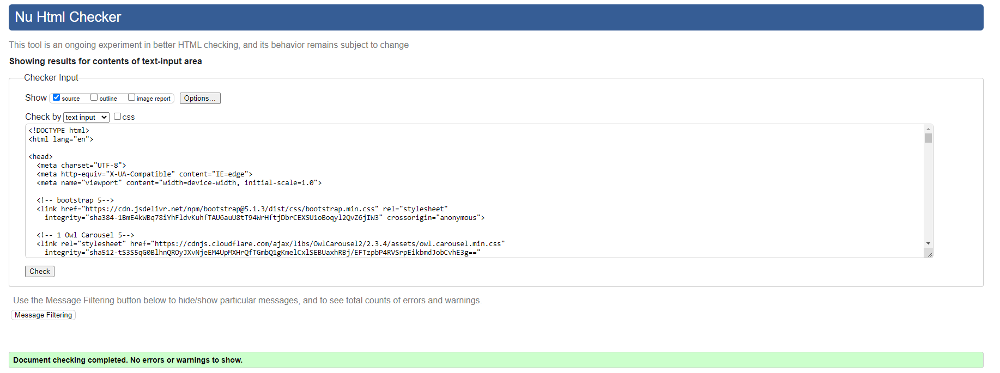
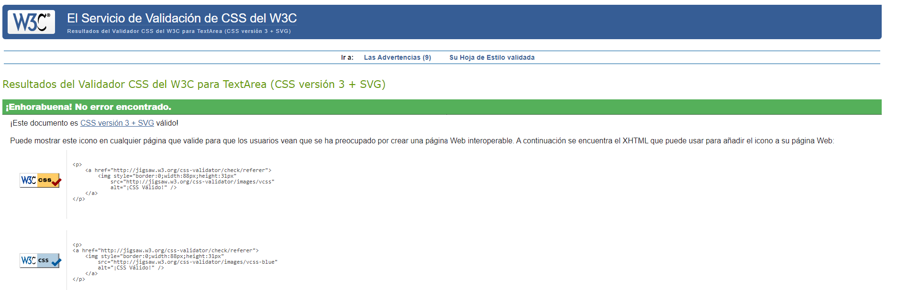
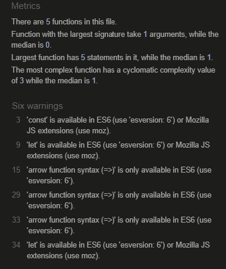
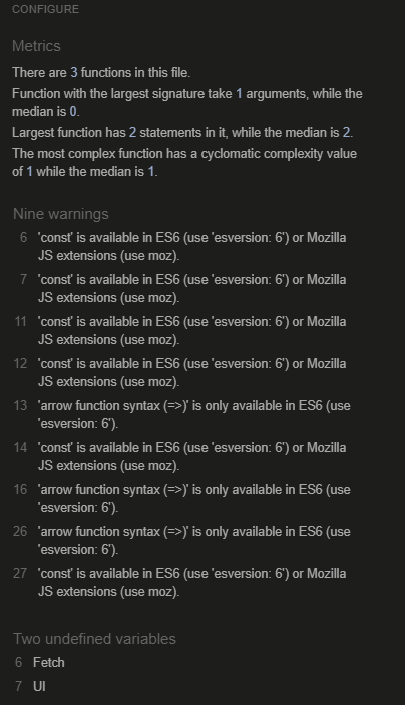
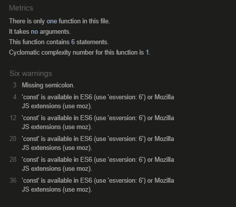

# The Climbing Club 

# A responsive website of a travel compnay specializes in Climbing activities and destinations, wich also offers Climbing courses 

## Code Institute - Milestone Project 2

## HTML/ CSS / JAVASCRIPT - Interactive front end Development Milestone Project.

### By Manuel Perez

[View Repository in GitHub Pages] (https://github.com/Manuperezro/The-Climbing-Club-MS2)

[view Website Link ] (https://manuperezro.github.io/The-Climbing-Club-MS2/)

## The Why

Shows the offer that the climbing Club has to the specific customers.

Invite the customers to navigate throught the website and discover the products.

## The Bussines Goal

+ Increase the booking on retreats in different countries.  
+ Increase booking on courses in the UK cities.

## (UX) User Experience: 

Users will be able to navigate through the website easy and find relevant information that will help them to made a choice before purchase any product.

Users will have two differents forms to made contact with the organization, one is a formal email, and the other one is an enquery form.  

- ### User Stories

  - #### First time Users Goals:
     - To be captivated by the content.
     - To get to know about the products offered, retreats and courses.
     - To Navigate to the site easyly and interact with the content.
     - To understnd how to made an enquery 
      -to be able to use the information in the maps. 
  - #### Returning Users Goals:
     - To remember how to find relevant information 
     (Remember how to navigate).
     - Find the best and easy way to contact the studio.
     - Find relevant links.
  - #### Frequent Users Goals:
     - To see if there is any new retreat course or activity.
     - To be able to check the weather in the destination.
    
    ## Design:

The Desing of the website is made to invite visitors to book and to sell them a different way of Holidays,
So I tried to do a strong and captative design website,  with stronge colors contrast and I include a light / dark mode to ensure that can be confortable to every individual, 
easy to navigate through and stronge and pleasant at the same time. 
I Include some pictures of the destinations to call the atention of the users and  pictures of climbers practicing some indoor and outdoor climbing, with the idea of motivate users to purchase.

### Design Brief:

+ Colour:

The main colours used in the web are: 

- black: Black is a strong color often associated with sophistication, elegance, authority, power, sleekness, stability, strength, formality, and intelligence.

- light grey: considered the colour of architecture, commerce and theory. Some psychologies studies agreed the grey brings; neutrality, wisdom, intelligence, futuristic, resignation, stable, dignity, and compromise.

- Orange :  Orange is often described as an energetic colour. It may call to mind feelings of enthusiasm and excitement. Because orange is a high-energy color, many sports teams use orange in their uniforms, mascots, and branding.

Characteristic that suit perfectly with the needs and goals of the website.

- Links : The colour of the Icons/Links to navigate in the footer are orange with a blue hover with the purpose to made easy to users to identify that they are external links.

+ Typography:

- Font family: Poppins.

+ Images:

- Background image land page : I choose an stronge image with black and orange 2 captatives colors. to end an stronge message to the user.

- retreats images : I choose good quality images of the destinations to made the products more attractive

- courses images : I chose images the practicioners enjoying climbing outdoors and indoors so the users can imagine themselvs having fun while practice 

## Wireframes

The Basic structure of The climbing Club was skectched using [balsamiq](https://balsamiq.com/).

Here some images of the proccess( to see full wireframe click PDF) : 

-  PC Mac screen: 

- Courses and retreats lyout 

- Courses and retreats lyout 

- Mobile screen: 

## Features

 - #### Existing Features:
     
   + Navigation bar with dark and light mode with links to the “Home”, “retreats”, "courses", “weather” and "enquery" in all pages, and to contact form , customers reviews in Index.html. (Home page)

   + Enquery form with email.js wich connect directly the user to the company.

   + Google maps API, to get the user an intereactive map where the distances from the Hotel, the climbing crags, the higking path etc can be see clicking the differents buttons.

   + A weather App to see the current weather in all the cityes so the users can have an idea of the temperatures, visibility and winds speed, with the idea of help users to prepare the adecuated material for weather conditions.
## Technologies: 

### Languages used: 

- [HTML](https://en.wikipedia.org/wiki/HTML5)

- [CSS](https://en.wikipedia.org/wiki/CSS)

-[JAVASCRIPT](https://en.wikipedia.org/wiki/JavaScript)

### Also I used: 

- [Bootstrap](https://en.wikipedia.org/wiki/Bootstrap_(front-end_framework)

  From Bootrap I used: grid system, the nav, the buttoms, modals and part of the forms layout. 
  Everything has been modify to the project requirements and styled with CSS.
  
- [Google Fonts](https://en.wikipedia.org/wiki/Google_Fonts)

- [Font awesome](https://fontawesome.com/v4.7/icons/)

- [Balsamiq](https://balsamiq.com/)

- [Pexels](https://www.pexels.com/)

- [Pexels](https://en.wikipedia.org/wiki/JQuery/)

## Testing: 

### Testing results:

- [W3C Markup Validation Service](https://validator.w3.org/)

 + To validate HTML and CSS code.

 - [Js Hint Validation Service](https://jshint.com/)

 + To validate JavaScript code.

 Validators Results :

Index.html 

retreats.html 

courses.html 

weather.html 

Equery.html 

style.css 

JS files

                                                               
Main.js   mapButtons.js 

Data.js  app.js  
                                                         
weather.js   sui.js 

googleMaps.js

