# The Climbing Club 

# A responsive travel company's website specialized in Climbing  activities and destinations, wich also offers Climbing courses 

## Code Institute - Milestone Project 2

## HTML/ CSS / JAVASCRIPT - Interactive front end Development Milestone Project.

### By Manuel Perez

[View Repository in GitHub Pages] (https://github.com/Manuperezro/The-Climbing-Club-MS2)

[view Website Link ] (https://manuperezro.github.io/The-Climbing-Club-MS2/)

- [The Climbing Club](#the-climbing-club)
- [A responsive travel company's website specialized in Climbing  activities and destinations, wich also offers Climbing courses](#a-responsive-travel-company-s-website-specialized-in-climbing--activities-and-destinations--wich-also-offers-climbing-courses)
  * [Code Institute - Milestone Project 2](#code-institute---milestone-project-2)
  * [HTML/ CSS / JAVASCRIPT - Interactive front end Development Milestone Project.](#html--css---javascript---interactive-front-end-development-milestone-project)
    + [By Manuel Perez](#by-manuel-perez)
  * [The Why](#the-why)
  * [The Bussines Goal](#the-bussines-goal)
  * [(UX) User Experience:](#-ux--user-experience-)
    + [User Stories](#user-stories)
      - [First time Users Goals:](#first-time-users-goals-)
      - [Returning Users Goals:](#returning-users-goals-)
      - [Frequent Users Goals:](#frequent-users-goals-)
      - [Website Owner Goals:](#website-owner-goals-)
    + [I want customers:](#i-want-customers-)
  * [Design:](#design-)
    + [Design Brief:](#design-brief-)
  * [Wireframes](#wireframes)
  * [Features](#features)
      - [Existing Features:](#existing-features-)
        * [Index.html (Main page)](#indexhtml--main-page-)
        * [retreats.html (Retreats page)](#retreatshtml--retreats-page-)
        * [courses.html (Courses page)](#courseshtml--courses-page-)
        * [Enquiry.html (Booking page)](#enquiryhtml--booking-page-)
  * [Technologies:](#technologies-)
    + [Languages used:](#languages-used-)
    + [Frameworks Libraries and programmes used:](#frameworks-libraries-and-programmes-used-)
    + [APIs Application Programming Interface used:](#apis-application-programming-interface-used-)
  * [Testing:](#testing-)
    + [Testing results:](#testing-results-)
- [Validators Results :](#validators-results--)
- [JS files](#js-files)
- [light House](#light-house)
    + [Testing User Stories from User Experience (UX) Section](#testing-user-stories-from-user-experience--ux--section)
      - [First Time Visitor Goals:](#first-time-visitor-goals-)
          + [As a First Time Visitor, I want to easily see what the products offers is, be able to find how to contact the organization and to navigate easyly throught the site:](#as-a-first-time-visitor--i-want-to-easily-see-what-the-products-offers-is--be-able-to-find-how-to-contact-the-organization-and-to-navigate-easyly-throught-the-site-)
        * [As a First Time Visitor, I want to be able to navigate easyly and intuitive throughout the site to find content related the products that the company offer and tools to decided / plan holidays:](#as-a-first-time-visitor--i-want-to-be-able-to-navigate-easyly-and-intuitive-throughout-the-site-to-find-content-related-the-products-that-the-company-offer-and-tools-to-decided---plan-holidays-)
        * [As a first time visitor I want to see some stories and reviews from other ussers to get to know the organization. I also Want to find the links to the social media to find more information about the organization and users thoughts and reviews and be able to determine how trasted and known the studio is:](#as-a-first-time-visitor-i-want-to-see-some-stories-and-reviews-from-other-ussers-to-get-to-know-the-organization-i-also-want-to-find-the-links-to-the-social-media-to-find-more-information-about-the-organization-and-users-thoughts-and-reviews-and-be-able-to-determine-how-trasted-and-known-the-studio-is-)
      - [Returning Visitor Goals:](#returning-visitor-goals-)
        * [As a returning Visitor, I want to find the products that I already seen and relevant information about them :](#as-a-returning-visitor--i-want-to-find-the-products-that-i-already-seen-and-relevant-information-about-them--)
        * [As a returning Visitor, I want to be abel to send an enquery in simple steps:](#as-a-returning-visitor--i-want-to-be-abel-to-send-an-enquery-in-simple-steps-)
        * [As a Returning Visitor, I want to find the best way to get in contact with the organisation with any questions I may have:](#as-a-returning-visitor--i-want-to-find-the-best-way-to-get-in-contact-with-the-organisation-with-any-questions-i-may-have-)
      - [Frequent Users Goals:](#frequent-users-goals--1)
        * [As a Frequent User, I want to be able to book a class easyly:](#as-a-frequent-user--i-want-to-be-able-to-book-a-class-easyly-)
  * [Deployment:](#deployment-)
    + [Inception:](#inception-)
      - [Deployment to GitHub Pages:](#deployment-to-github-pages-)
    + [Cloning repository:](#cloning-repository-)
    + [Forking repository:](#forking-repository-)
  * [Credits:](#credits-)
  * [Tutorials:](#tutorials-)
  * [Aknowledgements:](#aknowledgements-)

<small><i><a href='http://ecotrust-canada.github.io/markdown-toc/'>Table of contents generated with markdown-toc</a></i></small>

## The Why

Shows the offer that the climbing Club has to the specific customers.

Invite the customers to navigate throught the website and discover the products.

## The Bussines Goal

+ Increase the booking on retreats in different countries.  
+ Increase booking on courses in the UK cities.

## (UX) User Experience: 

Users will be able to navigate through the website easy and find relevant information that will help them to made a choice before purchase any product.

Users will have two differents forms to made contact with the organization, one is a formal email, and the other one is an enquery form.  

- ### User Stories

  - #### First time Users Goals:
     - To be captivated by the content.
     - To get to know about the products offered, retreats and courses.
     - To Navigate to the site easyly and interact with the content.
     - To see information about each destination.
     - To understand how to made an enquery 
     - To sign up to a newsletter.
     - To be able to use the information in the maps. 
  - #### Returning Users Goals:
     - To make a booking enquiry.
     - To be able to contact the company.
     - To send a contact message.
     - To be able to see the companies social media.
     - To be able to search for local climbing crags and points of interes for each destination.
  - #### Frequent Users Goals:
     - To see if there is any new retreat course or activity.
     - To be able to check the weather in the destination.
     - To see reviews before I decide to book.
  - #### Website Owner Goals:
  - ### I want customers: 
      - to be able to find information easily.
      - to be able to enquire about any of the products.
      - to be able to made contact easily with the organization.
      - to navigate back and forard from any of the products pages to the booking or weather pages.
    
    ## Design:

The Desing of the website is made to invite visitors to book and to sell them a different way of Holidays,
So I tried to do a strong and captative design website,  with stronge colors contrast and I include a light / dark mode to ensure that can be confortable to every individual, 
easy to navigate through and stronge and pleasant at the same time. 
I Include some pictures of the destinations to call the atention of the users and  pictures of climbers practicing some indoor and outdoor climbing, with the idea of motivate users to purchase.

### Design Brief:

+ Colour:

The main colours used in the web are: 

- black: Black is a strong color often associated with sophistication, elegance, authority, power, sleekness, stability, strength, formality, and intelligence.

- light grey: considered the colour of architecture, commerce and theory. Some psychologies studies agreed the grey brings; neutrality, wisdom, intelligence, futuristic, resignation, stable, dignity, and compromise.

- Orange :  Orange is often described as an energetic colour. It may call to mind feelings of enthusiasm and excitement. Because orange is a high-energy color, many sports teams use orange in their uniforms, mascots, and branding.

Characteristic that suit perfectly with the needs and goals of the website.

- Links : The colour of the Icons/Links to navigate in the footer are orange with a blue hover with the purpose to made easy to users to identify that they are external links.

+ Typography:

- Font family:'Poppins', sans-serif;

+ Images:

- Imagery was very important to me and I choose images that conveyed the feel of the company throughout. I tried to choose images of attractive and popular landmarks for each retreat destination and also good quality and attractive immages of indoor and outdoor climbing scenarios for the courses section.. 

- Icons
I used line awesome for icons for social media links which I've included in the footer. I've also used blue color hover on the icons to help draw attention to them and to show the user they are clickable. 

- Background image land page : I choose an stronge image with black and orange 2 captatives colors. to end an stronge message to the user.

## Wireframes

The Basic structure of The climbing Club was skectched using 

  [balsamiq](https://balsamiq.com/).

Here some images of the proccess( to see full wireframe click PDF) : 

- PC Mac screen: 

 

- Courses and retreats lyout 

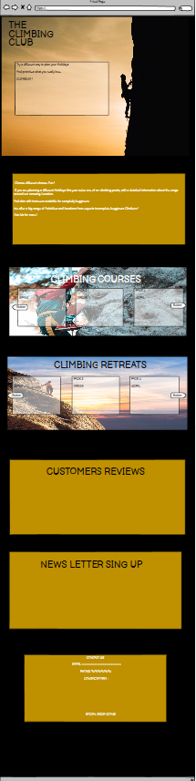

- Courses and retreats lyout

 

- Mobile screen: 

 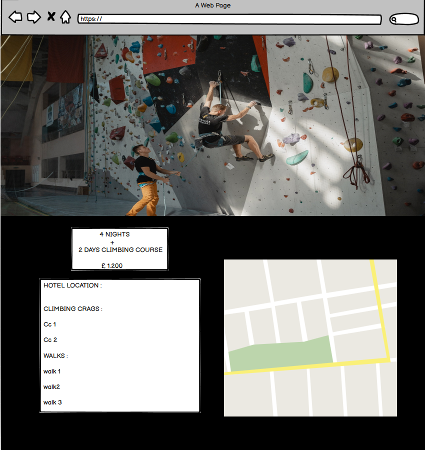

## Features

 - #### Existing Features:

 - ##### Index.html (Main page)
     
   + Navigation bar with dark and light mode 

   - Navigation Menu.
     With the help of the codelab youtube tutorial (details in the credit section) I have created a responsive navigation bar menu. wich change and addapt the from a menu bar to a hambruguer menu. also include the Dark and Light swift mode.
     
   - big screen :
   
   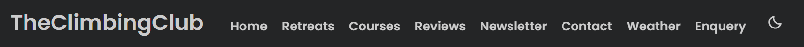

   - Small screen : 
   
   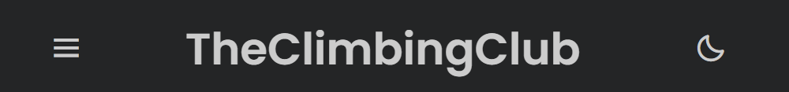

   - Small screen : 
   
   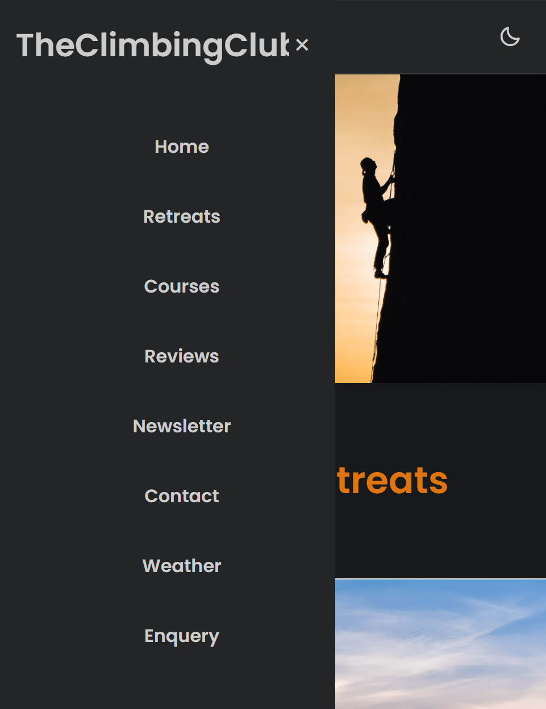

   + Products Sliders.

   - With the help of  owl carousel youtube tutorial and bootsrapt I have created 2 sliders sections for the two products that the organization offers. retreats and courses.

  - Retreats Slider : 
   
   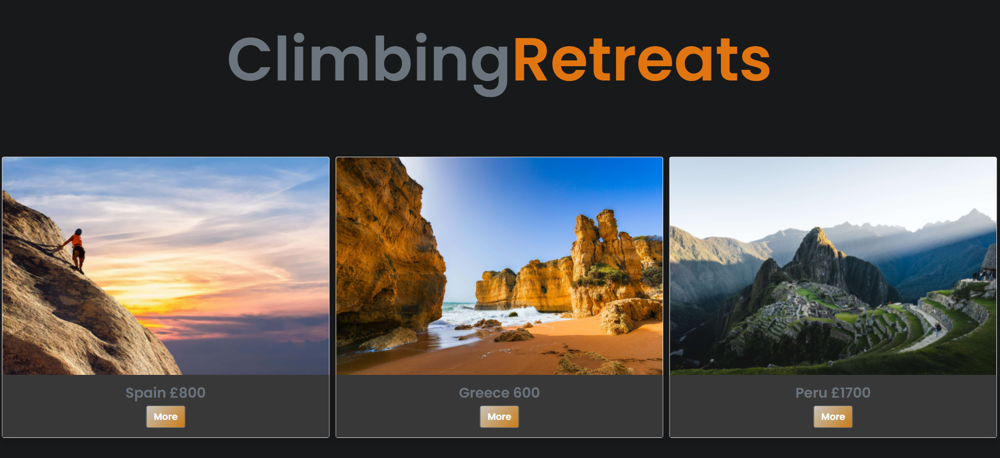

  - Courses Slider : 
   
   

   + Testimonials.

   - In the testimonials section I have created a 3 customers review section.

   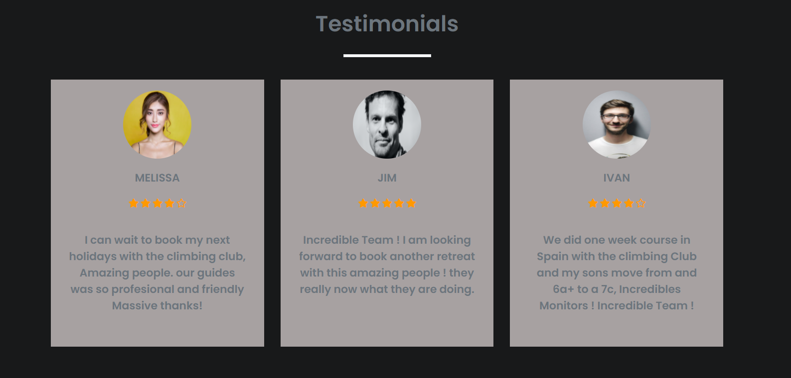

   - With Javascript, (Jquery) I have created a onmousenter/onmouseleave effect where if the user move the mouse over one of the customers section the text is higlited in whithe to attract the attention and invite customers to read.

   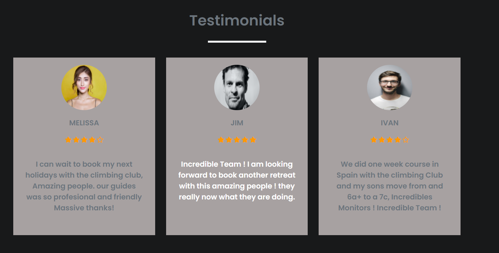
   
   + Newsletter 

   - I have a created a newsletter section to allow the user to type his email address and click the botton to join the newsletter.

    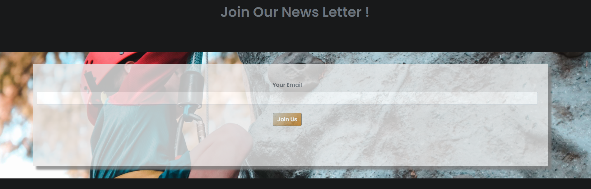

   - Using the bootstrap modal, I have add a modal to let the user know that is succecfully joined.

    

   + Contact form

   - In the contact Us section I have include a simple contact form with email.js and Boostrap. To made easy to the user to comunicated 
     with the organization.

    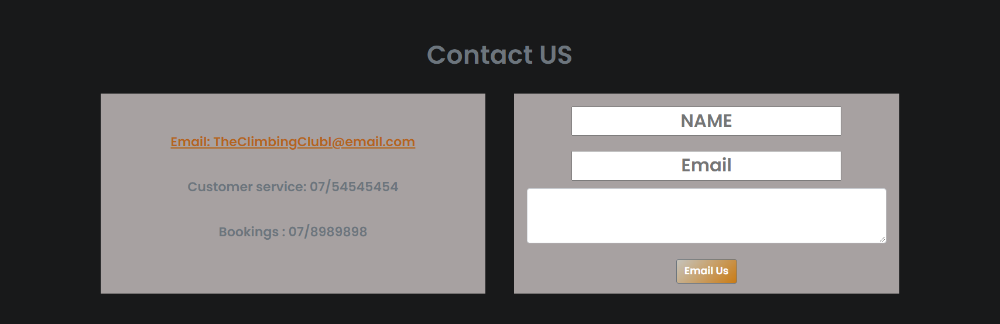

   + Footer

   - In the footer section I have created Icons with fontAwesome for the coial media link, I have left a Blue effect hover to made it clear that they are clickeable links.

    

  - ##### retreats.html (Retreats page)

   + In the Retreats section I have created 5 maps for each retreat destination calling the Google maps API to create the maps, and using javascrip to get the user to intereactive with the map using the buttons, to see diferents markers that shows points of interest in the destination as  Climbing Crags, the location of the hotel, hiking routes and natural monuments. So the user can see the distance from the hotel.
 
    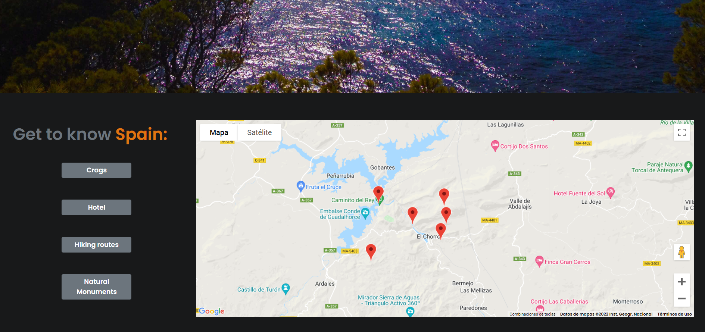

   - ##### courses.html (Courses page)

   + In the courses page I used google maps iframes to show the users the locations where the courses will take place.
 
    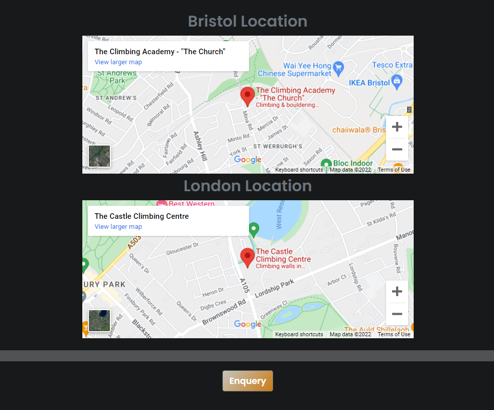

    - ##### Weather.html (Weather App page)

   + Using the OpenWeather API I Have created a weather App page where the user can see the current weather in any city in the world so the users can have an idea of the temperatures, visibility and winds speed.
   The idea is to help users to prepare the adecuated climbing material for weather conditions.
    
    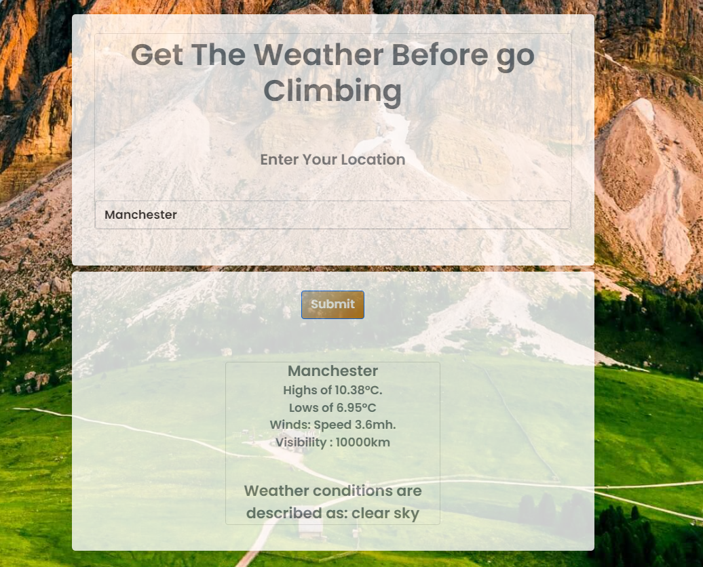

   - ##### Enquiry.html (Booking page)

   + Using email.js API and boostrap I Have created an enquery form where the users can spicify and book for any of the products that the organization offers. 
    
    

  
## Technologies: 

### Languages used: 

- [HTML](https://en.wikipedia.org/wiki/HTML5)

- [CSS](https://en.wikipedia.org/wiki/CSS)

- [JAVASCRIPT](https://en.wikipedia.org/wiki/JavaScript)

### Frameworks Libraries and programmes used: 

- [Bootstrap](https://en.wikipedia.org/wiki/Bootstrap_(front-end_framework)
  
- [Google Fonts](https://en.wikipedia.org/wiki/Google_Fonts)

- [Font awesome](https://fontawesome.com/v4.7/icons/)

- [Balsamiq](https://balsamiq.com/)

- [Pexels](https://www.pexels.com/)

- [Git](https://git-scm.com/)

- [Gitpod](https://github.com/)

- [Github](https://github.com/)

- [Balsamiq](https://balsamiq.com/)

- [JQuery](https://jquery.com/)

### APIs Application Programming Interface used: 

- [Google Maps APIs](https://developers.google.com/maps/)

- [OpenWeather Api](https://openweathermap.org/)

- [Email.js](https://www.emailjs.com/)

## Testing: 

### Testing results:

- [W3C Markup Validation Service](https://validator.w3.org/)

 + To validate HTML and CSS code.

 - [Js Hint Validation Service](https://jshint.com/)

 + To validate JavaScript code.

 # Validators Results :

Index.html 

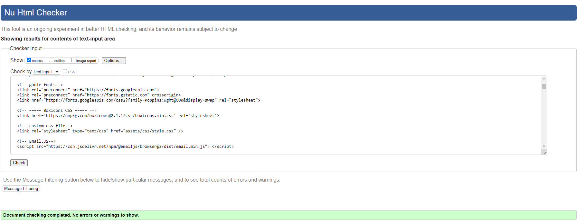

retreats.html 

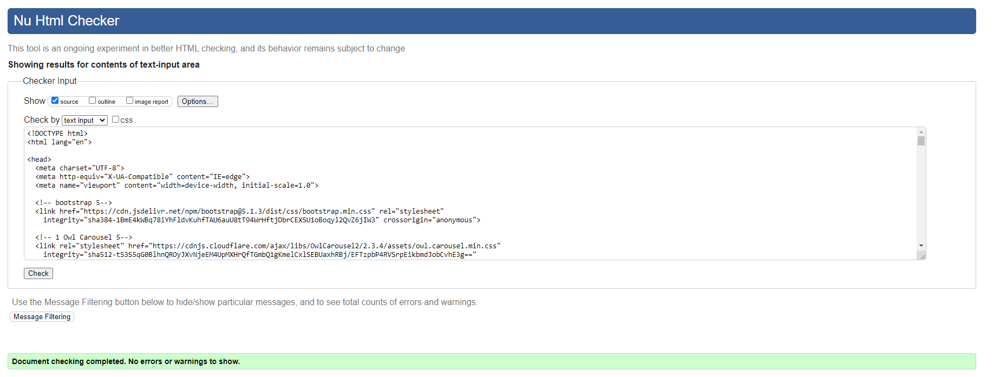

courses.html 

weather.html 

Equery.html 

style.css 

# JS files

Main.js 
 

mapButtons.js 
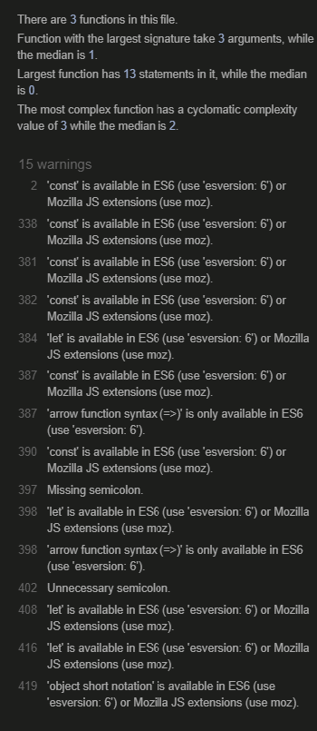

Data.js
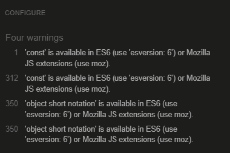

app.js 

                                                         
weather.js 
 

sui.js
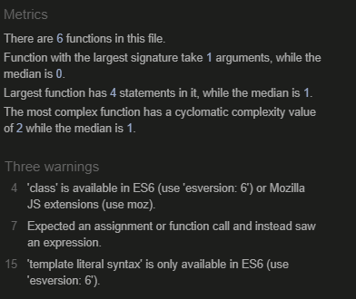

googleMaps.js

# light House

index.html
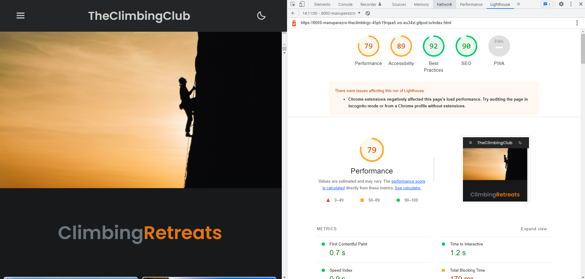

retreats.html
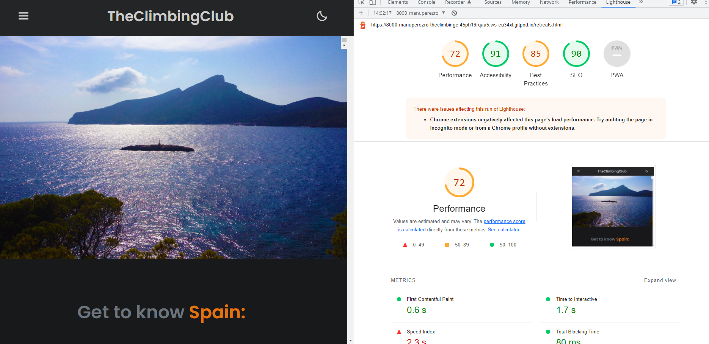
                                                         
courses.html
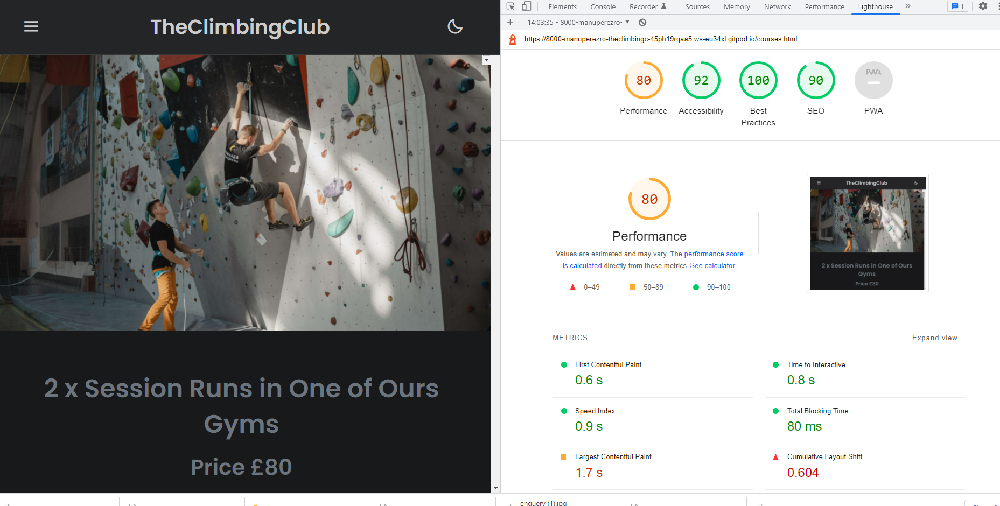 

weather.html
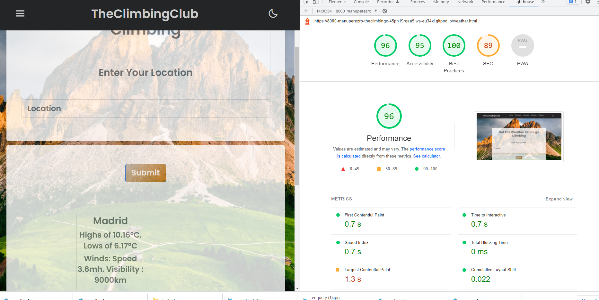

enquery.html
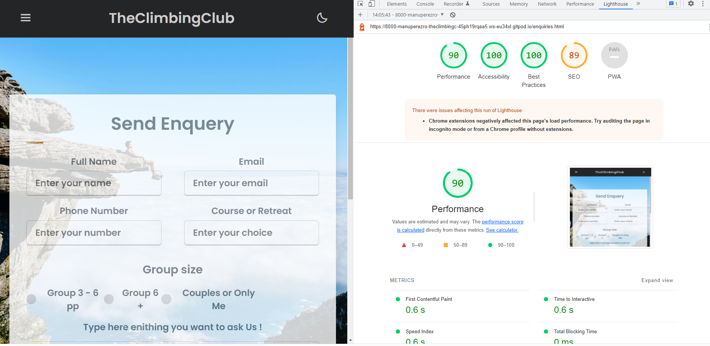

+ Performance is low in some pages due to the high quality and resolution of the pictures, this will be resolve with an app that can resize the imgs. 
  (They already have being reduce with a free app "tinyjpg"  but to achieeve better results will need to pay another app.)

### Testing User Stories from User Experience (UX) Section

 #### First Time Visitor Goals: 

  ######  As a First Time Visitor, I want to easily see what the products offers is, be able to find how to contact the organization and to navigate easyly throught the site:
     
     - Upon entering the site users will see a stronge hero image wich can give them an Idea of the type of products the company offers (Holidays Outdoors and Adventours).

     - Just at the botton the users can find the slider carousel with all the retreats around the world that the company offers, every image got a button to ghuide the users to the retreats page, where more detailed info about the retreats producst can be found. 
     
     - Follow  this the Users can find another slider carouses with the courses that take place in the parterns gym climbing centers and outdoors located in London and Bristol.

     - Follwing the products sliders users will find customers tetimonials in wich one the paragraphs are highlited when the users hover.

     - the next thing that the customer will see is a  small form to give the user the possibility to join  and received the newsletter with the last offers of the company.

     -  next : the users will se the first and "easy contact form"  where the users can send and email with any question to the organization, and also see the email address and contact phone.

  #####  As a First Time Visitor, I want to be able to navigate easyly and intuitive throughout the site to find content related the products that the company offer and tools to decided / plan holidays:

    - At the top of each page the users can find the header with the logo and the navigation menu, 
    wich mades easy to navigates through the pages of the site. 

    - At the botton of the hero image users can see easily the two main products that the organization offers, and find buttons with colors wich made intuitive to navigate into the more detailed information.

  ##### As a first time visitor I want to see some stories and reviews from other ussers to get to know the organization. I also Want to find the links to the social media to find more information about the organization and users thoughts and reviews and be able to determine how trasted and known the studio is:

    - At the bottom of all pages the users can find the footer, with icons of the social media links, so the user can click easyly and see how  real the company is ("Credibility")

    - After the 2 main product sections users can find some customer's testimonials.
     
  #### Returning Visitor Goals: 

  ##### As a returning Visitor, I want to find the products that I already seen and relevant information about them :
   
    - The user will want to find the product that he saw easyly and with a few clicks. Users can acces to the main products detailed pages in 2 ways, Navbar and slide carousel.

    - The user will want to acces easysyly to the weather app to made sure how the weather in the destination is. In the same way the users can acces to the weather app easyly with the navbar.

  
  ##### As a returning Visitor, I want to be abel to send an enquery in simple steps:

     - User will want to send a enquery. Also linked with the Navbar at the top of every page.

  ##### As a Returning Visitor, I want to find the best way to get in contact with the organisation with any questions I may have:

     - In the main page users will find a contact form at the bottom of the main page.

     - In the main page users will find a contact phone number at the bottom of the main page.

 #### Frequent Users Goals:

##### As a Frequent User, I want to be able to book a class easyly:

    - The user would already be comfortable with the website layout and can easily click to find the sections with specific products they are interested in.

    -The user will be able to find the weather app in no more than 2 clicks
## Deployment:

### Inception:

 + this project was created using Code Institute template from GitHub:

 + After the creation of the project, I rename it as : MSP1-Code-Institute-Yoga-School.

 + In order to push this project from GitPod to Github I used a set of git commands on the terminal: 
  
- git status  - Check the status of the repository and see if there were any changes in files 

- git add .  - Add the files that were modified/created, so we can commit it 

- git commit -m "message for commit"  - Commits all the changes

- git push  - Pushes all committed versions to GitHub.

#### Deployment to GitHub Pages:

+ The project was deployed to GitHub Pages using the following steps:

- Log in to GitHub and locate GitHub Repository

- At the top of repository click on "Settings"

- Once you are in settings scroll down to "GitHub Pages"

- Under "Source", click the dropdown called "None" and select "Master Branch".

- After the page automatically refresh scroll down again on "GitHub Pages" and I will  see live link to the published site.

### Cloning repository:

+ Local Clone

- Log in to GitHub and locate GitHub Repository

- At the top of repository click on Code

- From the dropdown menu under HTTPS copy the link

- Now on the IDE create a directory where you want to make the clone

- Type git clone and paste the link that you copy from step 3.

### Forking repository:

By forking the GitHub Repository we make a copy of the original repository on our GitHub account to view and/or make changes without affecting the original repository by using the following steps:

- Log in to GitHub and locate the GitHub Repository
- At the top of the Repository (not top of page) just above the "Settings" Button on - - the menu, locate the "Fork" Button.
- You should now have a copy of the original repository in your GitHub account.

## Credits:

## Tutorials:

- CodeLab tutorials (Youtube tutorials).

- Owl carousel (Youtube tutorials).

- openweather API guides.

- Shanji Rajai,  2 Steve Griffin  Profesor youtube tutorials OpenWeather Api.

- Google Map Api Guides.

- Bootstrapt Documentations Guides.

## Aknowledgements:

A huge thank you to my mentor who has been incredibly helpful and approchable throughout this project.

Likewise, to the tutors for helping through to completion on this.

And to the teachers at the City of Bristol College: Pasquale and Ben for their time and energy.

Big Thanks.
